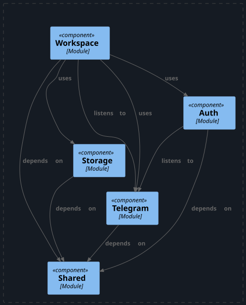

# Tensai CMS API

A headless content management system that transforms Telegram Forum groups into a full-featured, event-driven blogging
platform.

[](https://openjdk.org/) [](https://spring.io/projects/spring-boot) [](https://www.postgresql.org/) []()

## Table of Contents

- [Overview](#overview)
- [Architecture](#architecture)
- [Features](#features)
- [Tech Stack](#tech-stack)
- [Getting Started](#getting-started)
- [API Documentation](#api-documentation)
- [What I Learned](#what-I-learned)
- [License](#license)

---

## Overview

Traditional CMS platforms force writers to log into heavy admin dashboards and use isolated text editors. Tensai CMS
bridges the gap by turning the app we already use daily:Telegram:into a live publishing workspace.

By connecting a Telegram Bot to a specific Forum Group, content creators can write, upload media, and manage blog drafts
naturally inside topic threads. When a draft is ready, typing `/publish` instantly converts the thread into a structured
article available via a public REST API.

**[User Setup Guide](docs/tutorial.md)**

---

## Architecture

**Decision:** Modular Monolith — because it enforces strict, decoupled domain boundaries (like microservices) but
deploys as a single application, eliminating the network latency, data consistency headaches, and operational overhead
of distributed microservices. This is ideal for a focused backend system handled by a small team or solo developer.

Modules communicate synchronously via exposed Java API interfaces for data fetching, and asynchronously via Spring
`ApplicationEvent` for cross-module side effects.

### Module Dependencies



*(Generated via Spring Modulith)*

### Package Structure

```text
com.tensai.cms
├── auth/          # Authentication, user management, and security context
├── storage/       # File upload/download abstraction layer (S3/MinIO)
├── telegram/      # Telegram webhook listener, client, and event routing
├── workspace/     # Core CMS domain: blogs, drafts, comments, likes, and bot commands
└── shared/         # Cross-cutting concerns (Global exceptions, Shared types, etc)

```

--- 

## Features

- **Spring Modulith Boundary Enforcement :** Strict architectural rules tested programmatically to ensure unidirectional
  domain dependencies and clean module isolation.


- **External Microservice Decoupling :** Offloads raw Telegram webhook processing and payload translation to a dedicated
  microservice ([Telegram Update Gateway](https://github.com/itensai1/telegram-update-gateway)), ensuring the core CMS
  application remains clean, isolated, and focused purely on content domain logic.


- **Draft/Blog separation :** content is mutable as a draft but frozen as a blog, so editing after publishing doesn't
  corrupt what's live until you explicitly re-sync


- **Block-Based Content Modeling :** Flexible structured storage for blog posts and drafts using ordered content blocks
  (text, media, etc.).


- **JWT Authentication & Security :** Stateless token-based user verification with custom filter chains including a
  dedicated filter chain for service-to-service communication and password reset handlers.


- **Cloud-Native Media Storage :** Streams binary media directly to and from MinIO/AWS S3 for scalable document and
  image hosting.

---

## Tech Stack & Tools

| Layer                | Choice                                  |
|----------------------|-----------------------------------------|
| Language             | Java 25                                 |
| Framework            | Spring Boot 4.1                         |
| Build Tool           | Maven *(the included `./mvnw` wrapper)* |
| Modularity & Events  | Spring Modulith 2.1                     |
| Database & Migration | PostgreSQL & Flyway                     |
| Storage              | MinIO / AWS S3 SDK v2                   |
| Security             | Spring Security & JJWT                  |
| API Documentation    | SpringDoc OpenAPI 3.1                   |

---

## Getting Started

### Prerequisites

- Java 25+
- Maven (or the included `./mvnw` wrapper)
- Docker & Docker Compose (for PostgreSQL and MinIO)
- [Telegram Gateway API Service ](https://github.com/itensai1/telegram-update-gateway) *(Required for webhook event
  ingestion)*

### Run locally

```bash
# 1. Clone the repository
git clone https://github.com/itensai1/tensai-cms-api.git
cd tensai-cms-api

# 2. Spin up the PostgreSQL database and MinIO storage
docker-compose up -d

# 3. Run migrations + start the app
./mvnw spring-boot:run

```

### Environment variables

| Variable                                                    | Description                                                           |
|-------------------------------------------------------------|-----------------------------------------------------------------------|
| `SPRING_DATASOURCE_URL`                                     | PostgreSQL JDBC connection URL                                        |
| `SPRING_DATASOURCE_USERNAME` / `SPRING_DATASOURCE_PASSWORD` | Database authentication credentials                                   |
| `HIKARI_MAX_POOL_SIZE` / `HIKARI_MIN_IDLE`                  | HikariCP connection pool size settings (defaults: `20` / `5`)         |
| `ALLOWED_ORIGINS`                                           | Comma-separated origins for CORS security configuration               |
| `JWT_SECRET`                                                | Secret key for signing and validating JWT tokens                      |
| `APP_BASE_URL`                                              | Base application URL                                                  |
| `RESET_PASSWORD_PATH`                                       | Path template for user password reset requests                        |
| `S3_ENDPOINT`                                               | Endpoint URL for AWS S3 or self-hosted MinIO storage                  |
| `S3_ACCESS_KEY` / `S3_SECRET_KEY`                           | Credentials for S3-compatible object storage                          |
| `S3_REGION`                                                 | S3 storage region (default: `us-east-1`)                              |
| `S3_BUCKET_NAME`                                            | Target S3 bucket for uploaded files and media                         |
| `TELEGRAM_GATEWAY_API_SECRET`                               | Shared secret key for `X-Internal-Secret` header authentication       |
| `TELEGRAM_GATEWAY_API_URL`                                  | Base endpoint URL for internal Telegram Gateway service communication |

---

## API Documentation

### Authentication

| Method | Endpoint                      | Description                                                 | Security |
|--------|-------------------------------|-------------------------------------------------------------|----------|
| `POST` | `/api/v1/auth/login`          | Authenticates user credentials, returns a JWT access token. | Public   |
| `POST` | `/api/v1/auth/reset-password` | Resets a user password using a valid reset token.           | Public   |

### Blogs & Content Management

| Method | Endpoint                       | Description                                                                       | Security   |
|--------|--------------------------------|-----------------------------------------------------------------------------------|------------|
| `GET`  | `/api/v1/blogs`                | Retrieves a paginated list of published blog previews with filter by user option. | Public     |
| `GET`  | `/api/v1/blogs/{blogId}`       | Fetches a single blog post with its content blocks.                               | Public     |
| `POST` | `/api/v1/blogs/{blogId}/likes` | Toggles the like status on a specific blog post.                                  | JWT Bearer |

### Comments

| Method   | Endpoint                             | Description                                             | Security   |
|----------|--------------------------------------|---------------------------------------------------------|------------|
| `GET`    | `/api/v1/blogs/{blogId}/comments`    | Retrieves a paginated list of comments for a blog post. | JWT Bearer |
| `POST`   | `/api/v1/blogs/{blogId}/comments`    | Adds a new comment to an existing blog post.            | JWT Bearer |
| `PUT`    | `/api/v1/blogs/comments/{commentId}` | Updates the content of an existing comment.             | JWT Bearer |
| `DELETE` | `/api/v1/blogs/comments/{commentId}` | Removes a comment.                                      | JWT Bearer |

### Media

| Method | Endpoint                     | Description                                    | Security |
|--------|------------------------------|------------------------------------------------|----------|
| `GET`  | `/api/v1/file/download/{id}` | Streams binary media files stored in S3/MinIO. | Public   |

### Telegram Webhooks (Ingestion)

| Method | Endpoint           | Description                                                                                 | Security                   |
|--------|--------------------|---------------------------------------------------------------------------------------------|----------------------------|
| `POST` | `/telegram/events` | Ingests message posts, topics, media, and user registrations from the Telegram Gateway API. | `X-Internal-Secret` Header |

---

## What I Learned

- **Enforcing Modular Boundaries with Spring Modulith:** Moving away from standard layered packages to domain-driven
  modules eliminated tight coupling. I learned how to enforce strict boundaries and validate internal API dependencies
  using Spring Modulith's automated architecture tests.


- **The Power of the Strategy Pattern:** Managing Telegram bot commands and settings option buttons could easily devolve
  into massive, unmaintainable `switch` statements. By leveraging Spring’s auto-discovery to inject all `BotCommand` and
  `OptionBtn` implementations into a `List` at startup, I could map commands to their handlers and return available
  option buttons.


- **Flyway Database Migrations:** Designing a "perfect" database schema on day one is unrealistic. I learned to use
  Flyway to treat database schema evolution like Git for data—ensuring that changes are version-controlled, repeatable,
  and safely synchronized across all deployment environments.


- **DTO Projections for Efficient Reads:** Loading full JPA entities just to display summary lists creates unnecessary
  memory and processing overhead. I implemented Spring Data JPA projections to fetch only the exact columns needed
  directly from the database. Combined with pagination, this ensures endpoints remain fast and scalable as data grows.


- **S3 Object Storage Integration (MinIO):** Storing binary media inside a relational database severely degrades query
  performance. I resolved this by decoupling storage—saving raw files directly to an S3-compatible bucket while storing
  only lightweight reference keys in PostgreSQL, keeping database operations fast and media streaming scalable.

---

## License

This project is licensed under the MIT License — see [LICENSE](LICENSE) for details.

```